# Hướng dẫn sử dụng — my-crew (v50)

Trợ lý ảo tự động làm công việc quản lý dự án (PM / Scrum Master): đọc Jira · GitHub · Confluence ·
Slack, phân tích, rồi *tự hành động* (viết báo cáo, cảnh báo rủi ro, theo dõi OKR) như một PM thật.

Tài liệu này có **2 phần**:

- **Phần A — Cài đặt (1 lần, kỹ thuật):** dành cho người dựng hệ thống. Làm một lần lúc đầu.
- **Phần B — Vận hành hằng ngày (CEO / người quản lý):** không cần kỹ thuật. Dùng qua web + Telegram.

> **Ý tưởng cốt lõi:** trợ lý *tự chủ về tốc độ (mặc định); duyệt là tùy chọn*. Mọi hành động
> ghi ra ngoài (đăng Slack, tạo trang Confluence, gộp PR…) đều đi qua một cửa kiểm soát duy nhất —
> **Action Gateway**. Việc nguy hiểm (mất dữ liệu, lộ bí mật) bị **chặn cứng LUÔN**; việc quan trọng
> (gửi ra ngoài công ty, đóng PR) **chạy ngay mặc định** (để tự chủ nhanh) — nếu muốn duyệt trước
> từng hành động, bổ sung vào agent đó: `safety.trust_mode: guarded`.

---

# Phần A — Cài đặt (1 lần, kỹ thuật)

Chỉ cần làm một lần trên máy chạy hệ thống (macOS). Sau đó CEO vận hành 100% qua web + Telegram.

## A.1. Chuẩn bị

Cần sẵn trên máy (installer sẽ báo nếu thiếu, kèm lệnh cài):

| Công cụ | Cài bằng |
|---|---|
| `uv` (Python 3.12) | `curl -LsSf https://astral.sh/uv/install.sh \| sh` |
| Node.js + npm | `brew install node` |
| `git` | `brew install git` |
| `gh` (GitHub CLI) | `brew install gh` rồi `gh auth login` |

Ngoài ra cần **tài khoản + token** cho các dịch vụ tích hợp (điền sau, trong trình duyệt — **không**
gõ vào terminal):

- **OpenRouter** (bộ não LLM): 1 API key. Có giới hạn ngân sách $50/tháng, tự dừng.
- **Atlassian** (Jira + Confluence): site, email, 1 API token dùng chung.
- **Slack**: browser-token (xoxc + xoxd) + tên team.
- **GitHub**: qua `gh auth login` (không để trong file cấu hình).

## A.2. Cài bằng 1 lệnh

```bash
git clone https://github.com/phuc-nt/my-crew.git
cd my-crew
./deploy/install.sh
```

Script sẽ tự động:

1. **Kiểm tra công cụ** — thiếu gì báo ngay kèm lệnh cài chính xác, rồi dừng (không tự cài lên máy bạn).
2. `uv sync` — cài thư viện Python.
3. **Build giao diện web** vào thư mục tạm rồi thay vào chỗ đang chạy (không làm gián đoạn nếu web đang mở).
4. **Cài 3 MCP server** (Jira / Confluence / Slack). Mặc định: cài từ npm (bản đúng version,
   không cần build) vào `./.mcp-servers/` trong repo — 3 package đã publish. Thêm cờ `--mcp-dev`
   để tải + build thủ công 3 repo vào `~/workspace/` thay vì npm (dùng khi phát triển server local).
   - Muốn để chỗ khác (khi dùng `--mcp-dev`): đặt `MCP_BASE=<thư-mục>` trước khi chạy — script tự
     ghi đường dẫn vào `.env`.
5. **Cài dịch vụ launchd** (chạy nền, tự khởi động theo lịch).
6. **Kiểm tra sức khỏe** cuối: báo ✓/✗ cho từng phần (MCP, gh, đăng nhập) trước khi mở trình duyệt.

> **Chạy lại an toàn:** gọi lại `./deploy/install.sh` bất cứ lúc nào (sau `git pull` chẳng hạn). Nếu
> không có gì đổi, nó **không** khởi động lại dịch vụ — không làm chết agent đang chạy, không rớt phiên
> đăng nhập web. Chỉ khởi động lại phần thực sự thay đổi.

`gh auth login` là bước tương tác (không tự động được) — nếu chưa làm, health-gate sẽ nhắc.

## A.3. Điền bí mật trong trình duyệt (Setup Wizard)

Lần đầu, trình duyệt tự mở trang **Setup Wizard**. Đi qua các bước, mỗi bước có nút "Kiểm tra kết nối":

1. **OpenRouter (bộ não LLM)** — dán API key.
2. **Atlassian (Jira + Confluence)** — site, email, token, mã Jira project (vd `SCRUM`).
3. **Slack** — xoxc token, xoxd token, tên team, kênh đăng báo cáo.
4. **GitHub** — repo + kiểm tra `gh auth`.
5. **(Tùy chọn) Web search** — nếu dùng vai trò Nghiên cứu, bấm để bật Tavily hoặc Brave; điền API key. Không có = Nghiên cứu chỉ dùng nội bộ.
6. **Đặt mật khẩu** đăng nhập dashboard.

> **An toàn:** bí mật **chỉ** đi qua wizard này (ghi vào `.env` cục bộ), **không bao giờ** qua terminal
> hay URL. Sau khi hoàn tất, wizard tự khóa lại (không mở lại được để tránh chiếm quyền).

Xong bước này là hệ thống chạy. Từ đây trở đi xem **Phần B**.

## A.4. (Tùy chọn) Bật Telegram cho từng nhân sự ảo

Để CEO ra lệnh + nhận báo cáo qua Telegram: mỗi agent có thể gắn 1 bot Telegram riêng (tạo bot với
@BotFather, lấy token, gắn trong trang agent → tab "Kênh Telegram"). Xem chi tiết ở
[getting-started.md](v2/getting-started.md).

## A.5. Kiểm tra sức khỏe hệ thống

Bất cứ lúc nào, vào **Cài đặt → Sức khỏe hệ thống** trong web: bảng ✓/✗ từng kết nối. Mục nào lỗi sẽ
hiện lệnh khắc phục copy-paste được. Đây là chỗ để trả lời "vì sao agent không chạy?".

## A.6. Nhanh nhất: Thấy kết quả trong 30 giây (v49 — chỉ cần OpenRouter)

Nếu chỉ muốn trải nghiệm tính năng NGAY, không cần dịch vụ tích hợp (Atlassian/Slack/GitHub):

```bash
echo 'OPENROUTER_API_KEY=sk-or-...' >> .env
python -m my_crew.entrypoints.mpm quickstart      # chạy báo cáo dry-run
```

`quickstart` chọn agent mặc định, soạn báo cáo **mà không ghi ra ngoài** (an toàn thử).

Muốn dựng cả đội mẫu THẬT để giàn chứng năng:

```bash
python -m my_crew.entrypoints.mpm crew init       # tạo 5 nhân sự ảo mẫu
uv run python -m my_crew.runtime.service &        # bật bộ điều phối
```

Rồi truy cập web, màn **Đội** sẽ hiện trạng thái bộ điều phối + lệnh khởi động nếu cần.

---

# Phần B — Vận hành hằng ngày (CEO / người quản lý)

Không cần kỹ thuật. Mọi thứ qua **web** (trình duyệt) và **Telegram** (nếu đã bật ở A.4).

Mở web ở địa chỉ máy chạy (mặc định `http://127.0.0.1:8765`), đăng nhập bằng mật khẩu đã đặt.

## B.1. Bốn khu vực chính

Thanh điều hướng có 4 mục (giao diện gọn, CEO-first):

| Mục | Để làm gì |
|---|---|
| **Văn phòng** | MÀN CHÍNH (mở app vào thẳng đây): giao việc, theo dõi đội làm realtime, xem kết quả bàn giao — theo từng phòng việc. |
| **Đội** | Nhân sự ảo: trạng thái, ngân sách, tạm dừng/bật/xoá/tạo mới. |
| **Duyệt** | Hàng đợi việc cần bạn **phê duyệt** (badge số) + bảng việc lẻ đã giao cho từng nhân sự. |
| **Trợ lý** | Chat quản trị: hỏi tình hình, tạo nhân sự bằng hội thoại, lệnh vận hành lẻ. |
| **Cài đặt** | Sức khỏe hệ thống, giao diện, chế độ nâng cao, tự-xác-nhận giao việc. |

## B.2. Tạo một nhân sự ảo mới

> **Lưu ý (v18):** danh sách đội (`registry.yaml`) là dữ liệu CỦA BẠN — không nằm trong
> git, không bao giờ bị lệnh git làm mất. Lần chạy đầu hệ thống tự tạo từ mẫu
> `registry.example.yaml`. Nếu có hồ sơ nhân sự tồn tại trên máy mà chưa vào đội,
> trang **Đội** sẽ hiện mục "Hồ sơ chưa trong đội" — bấm "Thêm vào đội" là xong
> (nhân sự nhận việc được ngay, lịch báo cáo cũng tự kích hoạt).

Vào **Đội** → bấm **"+ Tạo nhân sự ảo"**. Có 2 đường:

### B.2a. Tạo từ template — tạo ngay (v32, ≤2 click)

Trang wizard hiện **bộ template nhân sự có sẵn** (6 vai trò: Trưởng phòng, Nghiên cứu, Nội dung, Phân tích, Kiểm định, PM-Coordinator). Mỗi template mang **tool gắn sẵn** (web search, academic search, lịch báo cáo mặc định, skills). Chọn card template → bấm **"Tạo ngay"** → xác nhận → nhân sự **được tạo NGAY** (chỉ 2 click, không qua form):

- Nhân sự mới sẽ **TẮT** theo mặc định. Điền token `.env` cho vai trò (nếu cần) rồi bấm **bật** ở trang **Đội**.
- Wizard **tuỳ-chỉnh** (chọn "Tạo tuỳ chỉnh") vẫn nguyên: full form nếu muốn đổi tên, báo cáo, hoặc cấu hình riêng.
- **(v36) Skill của template nạp TRỰC TIẾP lúc chạy**, không copy một lần lúc tạo — sửa skill trong
  file template thì **mọi nhân sự cùng vai nhận ngay**, không cần xoá-tạo lại. (Nhân sự tạo từ
  trước v36 vẫn dùng skill đã copy lúc tạo, không tự đổi theo template.)

### B.2b. Tạo cả đội — tạo crew (v32, ≤3 click)

Ở trang **Đội**, nút **"+ Tạo cả đội"** tạo nhanh **crew mặc định** (trưởng phòng + 4 nhân sự Nghiên cứu/Nội dung/Phân tích/Kiểm định):

1. Bấm nút → hệ thống **xem trước** danh sách đội (banner hiện **thành viên nào đã tồn tại** — skip, không abort).
2. Bấm **"Xác nhận tạo"** → tạo **độc lập từng người** (nếu 1 người lỗi, những người khác vẫn tạo).
3. Xong: trưởng phòng tự **set làm coordinator** nếu chưa có trưởng phòng nào; mọi người **TẮT** → tuân tự B.2a.

### B.2c. Qua hội thoại (tuỳ-chỉnh đầy đủ)

Nút dẫn vào **Trợ lý**, trợ lý hỏi bạn từng bước (loại nhân sự, tên, dự án, báo cáo nào, lịch chạy) rồi tạo giúp (lịch sử wizard, nhân sự **được bật** ngay).

Nhân sự ảo có thể thuộc nhiều "chuyên môn" (pack): PM, HR, Office… mỗi loại làm các báo cáo khác nhau.

### B.2d. Nâng cấp cấu hình khi template có bản mới (v36)

Khi bạn (hoặc bản cập nhật hệ thống) cải tiến **cấu hình** của một template (báo cáo/lịch/tool)
và tăng số phiên bản, trang **Đội** hiện huy hiệu **"⬆ bản mới vN"** cạnh tên các nhân sự đang
dùng template đó. Bấm huy hiệu → hộp thoại hiện:

- **Sẽ áp**: những trường chưa bị bạn tự chỉnh (an toàn cập nhật theo template mới).
- **Giữ nguyên**: những trường bạn đã tự tay sửa cho nhân sự đó — KHÔNG bị ghi đè.
- Hồ sơ hiện tại được **sao lưu tự động** trước khi ghi (có thể phục hồi tay nếu cần).

Bấm **"Nâng cấp"** để áp, hoặc **"Huỷ"** để bỏ qua lần này (huy hiệu vẫn còn, có thể nâng cấp sau).

## B.3. Giao việc cho đội

Cách nhanh nhất (v15): vào **Văn phòng** → ô **giao việc** ngay dưới màn hình, gõ theo 3 kiểu:

- **`@tên-nhân-sự <việc>`** — chỉ định người **chịu trách nhiệm chính (PIC)**. Ví dụ:
  `@noi-dung viết bài giới thiệu sản phẩm mới`. Gõ `@` sẽ hiện danh sách nhân sự để chọn.
- **`@all <việc>`** hoặc **không @ ai** — đội tự chọn PIC: hệ thống đề xuất người có vai trò
  khớp nhất và hiện trong kế hoạch để bạn thấy trước.
- PIC luôn đảm nhận **bước chốt/tổng hợp cuối cùng** của việc; các bước chuyên môn khác vẫn
  chia cho đúng người (kết hợp thật). Trên màn 3D, bàn của PIC có dấu **⭐** + nhãn **PIC**.

Sau khi gõ: hệ thống phân rã thành tối đa 7 bước → hiện **kế hoạch + PIC** → bạn bấm
**"Xác nhận giao việc"** (hoặc **Huỷ**). Kế hoạch xác nhận xong bị khóa (hash), đội tự chạy.

**Phòng việc (v16):** mỗi việc giao xong mở một **phòng việc** riêng — danh sách phòng nằm
bên trái màn Văn phòng (● đang chạy / ⚠ kẹt / ✓ xong). Vào phòng để: **hỏi tiến độ**
("tiến độ thế nào?"), **chỉnh kế hoạch** ("chỉnh: bỏ bước cuối…" — có xem DIFF trước),
hoặc **giao việc con** cùng phòng ("giao @thiet-ke …"). Quay lại phòng cũ luôn thấy đủ
lịch sử hoạt động. Lưu ý: câu trả lời "hỏi tiến độ" chỉ hiện tại chỗ, không ghi vào nhật ký.

> **Quan trọng:** đội chỉ thật sự CHẠY việc khi **bộ điều phối** đang bật
> (`uv run python -m my_crew.runtime.service`, hoặc dịch vụ nền theo mục A.2). Nếu nó chưa
> chạy, màn Văn phòng hiện **banner đỏ** cảnh báo — việc giao sẽ nằm chờ chứ không mất.


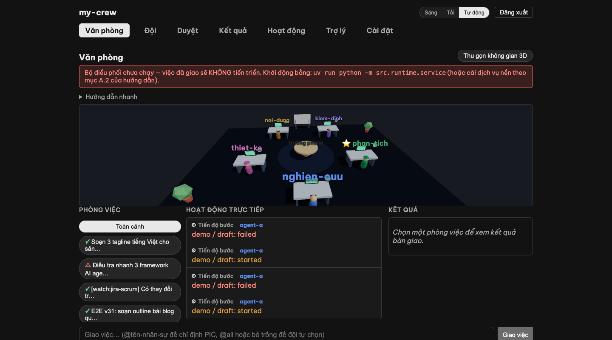

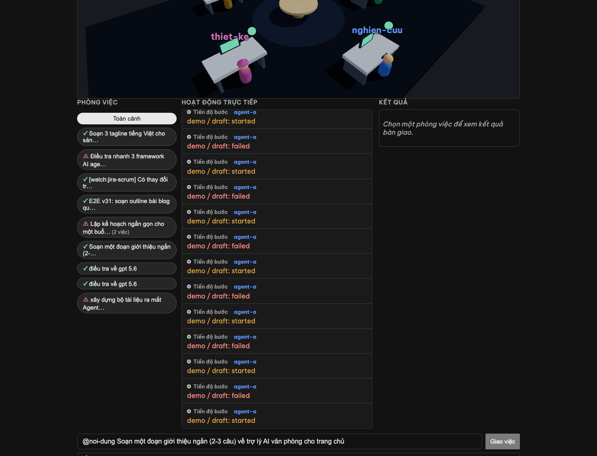

Muốn bỏ luôn bước bấm xác nhận? Bật **Cài đặt → "Tự xác nhận kế hoạch khi giao việc"** —
giao là chạy ngay (mọi việc gửi RA NGOÀI công ty vẫn chờ duyệt riêng như cũ):

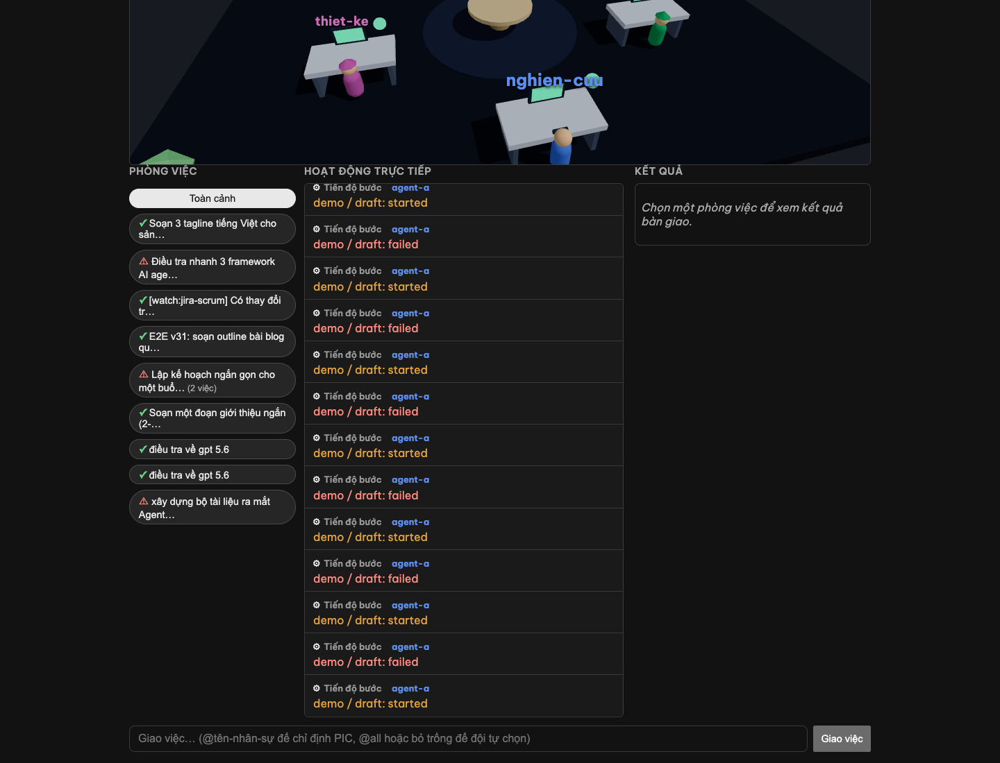

Vẫn giao được qua **Trợ lý** (gõ "giao việc …", hỏi-đáp từng bước) — cùng một đường xử lý.
Tiến trình hiển thị ngay cột phải màn Văn phòng; Telegram cũng nhận cột mốc (nhận việc /
xong bước / hoàn thành / cần duyệt).

### B.3a. Giao diện Văn phòng v54 — 3 khu vực (cockpit)

Màn Văn phòng được **thiết kế lại thành 3 khu vực** (≥1100px rộng; dưới đó xếp thành 1 cột):

| Khu vực | Nội dung |
|---------|---------|
| **Rail trái** (260px) | **"Chờ anh/chị"** — hàng chờ phê duyệt + câu hỏi (bấm nút trả lời hoặc gõ tự do). **"Sắp chạy"** — lịch công tác sắp tới (refresh mỗi 60s). Khi không có gì chờ = 1 dấu ✓. |
| **Giữa** (canvas + feed) | Màn 3D nhân sự (thu gọn được). Dưới: dòng hoạt động realtime với filter **[Tất cả \| Bước \| Ra ngoài]**. "Ra ngoài" = hành động gửi khỏi công ty (tên người, công cụ, kết quả, mục tiêu ngắn — KHÔNG nội dung tin nhắn). |
| **Phải** (≤300px) | Danh sách phòng việc (● / ⚠ / ✓). Chip chi phí từng phòng (tính khi chọn). Kết quả bàn giao. **Ngăn Kỹ thuật**: bấm dòng Soát chéo → hàng tiêu chí (✓/✗ + ghi chú lưu giữ). |

**Bảng 3D:**
- Mỗi nhân sự một bàn, màu avatar riêng (stable, 8 màu).
- **✋ Chuông tay chờ** trên bàn khi có phê duyệt/câu hỏi. Bàn điều phối cũng hiện.
- **×N số** khi ≥2 bước chạy song song trên cùng nhân sự.
- **Hình ma mờ** khi bước chạy trong sandbox (deep_team).
- Bàn **PIC** có ⭐.

**Dòng hoạt động (feed):**
- Tail 40 sự kiện (bước/mốc/soát chéo/ra ngoài). Lịch sử đầy đủ xem **Nhật ký**.
- Filter chip: **Tất cả** (mọi loại), **Bước** (chỉ bước), **Ra ngoài** (chỉ hành động gửi ngoài).

### B.3b. Duyệt việc — phụ thuộc vào chế độ tin tưởng (v30, autonomy-first)

Từ v30, **agent chạy việc ngay mặc định (autonomous mode)** để tự chủ nhanh. Tab **Duyệt** chứa 2 loại:

| Loại | Từ | Hành động |
|------|---|----------|
| **Việc từ agent ở chế độ "Guarded"** | Agent cấu hình `trust_mode: guarded` | Chờ bạn duyệt TRƯỚC khi chạy (như cũ) |
| **Việc "Đề xuất Automation"** | Automation script (không handler) | LUÔN chờ duyệt, mọi chế độ |

**Agent mặc định (autonomous):** hành động **gửi RA NGOÀI công ty** (đăng Slack ngoài, gửi email cho khách, gộp PR) **chạy NGAY** → hiện trong "Đã tự duyệt" (audit log ghi cụ thể). Không cần chờ bạn click.

**Nếu muốn agent chạy chậm hơn** (duyệt từng việc RA NGOÀI): vào **Đội** → chọn agent → tab "Cài đặt" → ghim vào dòng `safety.trust_mode: guarded` trong profile YAML của agent. Lần nâng cấp tiếp theo → agent thành chế độ này (release note v30 sẽ ghi rõ).

> **Cách thu hẹp scope:** Nếu chỉ muốn một agent nhất định hoạt động cẩn trọng, đừng cần tắt toàn bộ — chỉnh `trust_mode: guarded` cho agent đó. Các agent khác vẫn tự chủ.

> **Những việc nguy hiểm:** xoá vĩnh viễn dữ liệu, lộ bí mật — **không bao giờ** chạy, kể cả ở chế độ autonomous hay khi bạn duyệt. Chúng bị chặn cứng ở tầng dưới (Lớp A red line).

### B.3c. Đội tự kiểm và soát chéo (v13)

Mỗi bước công việc trải qua **vòng tự soát độc lập**:
- **Tự kiểm**: nhân sự chạy bước, tự so với yêu cầu (acceptance criteria), nếu không đạt thì tự sửa ≤2 lần.
- **Soát chéo**: sau bước xong, đồng nghiệp khác (kiểm định / QA) soát lại. Nếu cần sửa, bước quay lại tác giả tự sửa ≤2 lần.
- **Escalate**: nếu bước tự kiểm hoặc soát chéo không qua ≤2 lần → dừng + báo CEO xem xét.

Tiến trình này **tự động** (KHÔNG cần CEO duyệt từng lần tự kiểm/soát) — chỉ báo bạn khi kẹt.

### B.3d. Nhân sự hỏi ý kiến đồng nghiệp (v13)

Khi làm việc, nhân sự có thể hỏi ý kiến của đồng nghiệp khác (tối đa 2 câu/bước) để tham khảo SOUL + dự án của họ, rồi tiếp tục. Việc này:
- **Tự động, không cần CEO duyệt**: chỉ là tham vấn nội bộ (chỉ đọc, không ghi).
- **Hiển thị trên Văn phòng**: bong bóng hỏi-đáp giữa 2 bàn (1 hỏi, 1 trả lời).
- **Không tốn lượt rework**: là tham khảo, không phải "làm lại".

### B.3e. Chỉnh kế hoạch giữa chừng (v13)

Nếu kế hoạch đang chạy nhưng bạn muốn **sửa đổi** (bỏ bước không cần, thêm bước mới, hay giao lại người):

Vào **Trợ lý** → gõ **"chỉnh kế hoạch <id>: <yêu cầu>"** (ví dụ: "chỉnh kế hoạch task-123: bỏ bước phân tích, thêm bước soát hình ảnh").

Trợ lý sẽ:
1. Đề xuất sửa đổi (DIFF: giữ / bỏ / thêm bước + chi phí thay đổi).
2. Hiển thị **"DIFF"** để bạn xem thay đổi.
3. Nếu đồng ý, bấm **"Xác nhận sửa"** → kế hoạch cập nhật. Những bước đã xong giữ nguyên, những bước chờ/đang chạy sẽ chạy theo kế hoạch mới.

> **An toàn:** sửa đổi chỉ áp cho phần chờ chạy; phần đã xong không bị thay đổi. CEO (bạn) **luôn** xác nhận trước khi kế hoạch đổi.

## B.3f. Hai ống kính: chế độ Thường vs Kỹ thuật (dual-lens)

Trên header có nút chuyển ống kính — **👁 Thường** (cho CEO) vs **🔬 Kỹ thuật** (cho
người vận hành). Nút chỉ đổi thứ BẠN THẤY, không đổi quyền (trang nâng cao vẫn vào
được bằng URL trực tiếp như trước).

**Cả hai chế độ** đều thấy ở màn Văn phòng: bàn làm việc **đỏ nhấp nháy + bong bóng ⚠**
khi bước của nhân sự đó lỗi (tự hết khi nhân sự nhận lệnh mới), và **vòng sáng dưới
sàn** sau mỗi lượt kiểm định chéo — xanh = đạt, cam = cần sửa (kèm số lỗi).

**Chế độ Kỹ thuật thêm, ngay trong Văn phòng:**
- **dải sức khỏe**: nhịp tim điều phối, các kết nối ✓/✗, và **chip ngân sách** đội
  (chi tháng/trần; đỏ khi chạm 80%, tooltip từng nhân sự);
- huy hiệu **🔒** trên bàn/phòng có bước chạy sandbox Docker (deep_agent);
- bấm một bàn → **ngăn Chi tiết**: bước + pha hiện tại, engine, chi phí việc này,
  link trang nhân sự + Captures của việc;
- **Captures** (nav Nâng cao): bảng telemetry từng lượt chạy bước — engine, tokens,
  chi phí (exact/estimated), thời lượng, lỗi; lọc theo việc/nhân sự;
- **ô tìm lịch sử** trên header (tìm toàn văn việc đã làm; bấm kết quả nhảy tới phòng).

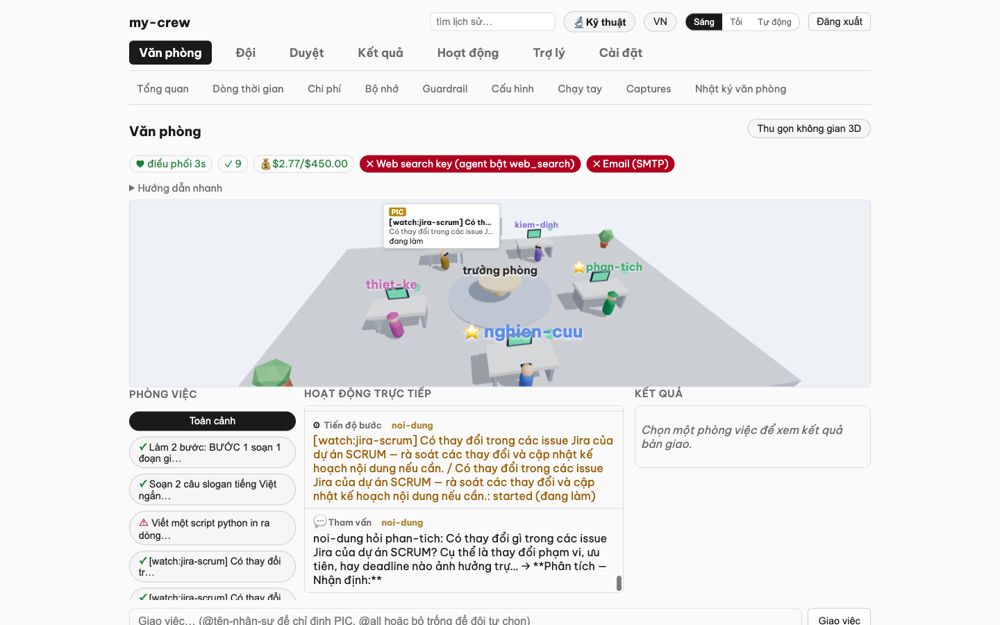

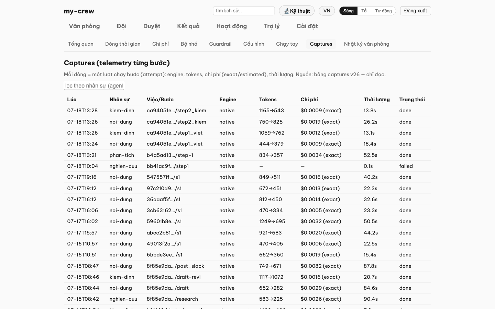

## B.3g. Chuyển ngôn ngữ: Tiếng Việt / English (v53)

Trên header (cạnh nút đổi giao diện sáng/tối) có nút **VN / EN**. Bấm để đổi:

- **Tiếng Việt (mặc định)**: tất cả menu, nút bấm, nhãn giao diện đều hiển thị bằng Tiếng Việt.
- **English**: tất cả cái vừa nêu dịch sang English, thuận tiện cho đội quốc tế.

**Thay đổi:** label nav ("Văn phòng" → "Office", "Đội" → "Team", v.v.), label cài đặt, và tất cả chữ giao diện tĩnh.

**Vẫn giữ Tiếng Việt ngay cả khi chuyển English:**
- Trạng thái sức khỏe hệ thống và thông báo lỗi (dữ liệu từ backend, không phải giao diện).
- Nội dung do LLM tạo (báo cáo, câu hỏi, lý luận của agent).
- **Thuật ngữ kỹ thuật** (giữ English cả hai ngôn ngữ để rõ ràng): Captures, Guardrail, PIC, deep_agent, sandbox, engine, tokens, MCP, autonomous, guarded.

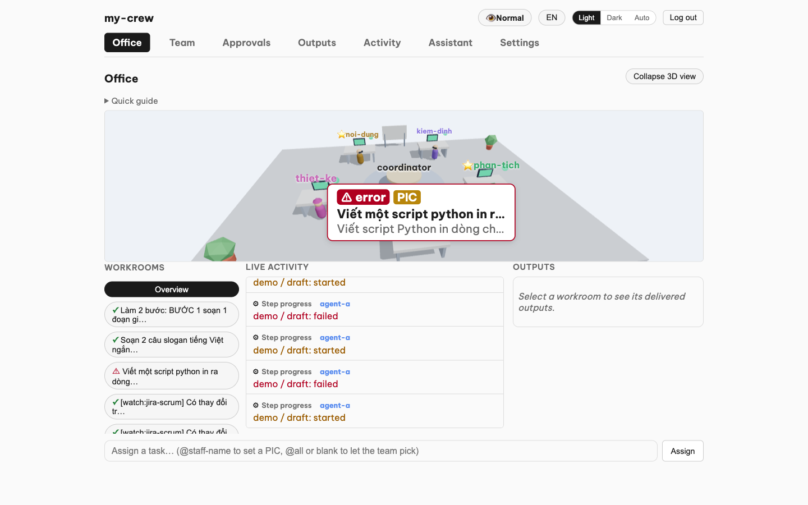

Lựa chọn của bạn được lưu trữ trên trình duyệt — lần tới vào web, giao diện tự nhớ ngôn ngữ bạn chọn.

## B.4. Chat với trợ lý điều hành

Vào **Trợ lý** (hoặc nhắn qua Telegram). Gõ câu hỏi/lệnh vào ô "Nhắn cho trợ lý…" rồi **Gửi**. Ví dụ:

- "Tình hình dự án SCRUM tuần này thế nào?"
- "Tạo cho tôi một nhân sự ảo theo dõi repo backend."
- "Chạy báo cáo hằng ngày ngay bây giờ."

> **An toàn:** trợ lý chỉ *xem trước* và hỏi lại; nó **không thực hiện** hành động ghi ra ngoài cho tới
> khi bạn gõ **"xác nhận"**. Nói chuyện thoải mái, không sợ nó tự ý làm.

### B.4a. "Trợ lý làm được gì?" — danh sách lệnh

Vào tab **Trợ lý** → bấm nút **"Trợ lý làm được gì?"** (hoặc gõ "help") → hệ thống liệt kê mọi **lệnh có sẵn** với **mô tả ngắn** (giao việc, tạo nhân sự, chỉnh kế hoạch, chạy báo cáo, v.v.). Mỗi lệnh có **gợi ý cách dùng** — bấm để copy sẵn vào khung chat rồi điền chi tiết.

## B.5. Xem Hoạt động công ty (v31)

Vào **Văn phòng → Hoạt động** (cột giữa) hoặc **Trợ lý** → hỏi "tuần này công ty làm gì?" — xem toàn bộ hành động của đội (khi gửi ra ngoài công ty, viết báo cáo, đổi lịch). Mỗi hành động ghi lại **ai**, **cái gì**, **kết quả**. Filter + phân trang. Nếu bật Telegram, CEO nhận tóm tắt tự động. Đây là **hệ thống duyệt lịch sử** (internal-only, không qua công ty bên ngoài).

## B.5a. Agent tự đổi lịch báo cáo (v31 — schedule_update)

Agent có thể yêu cầu qua chat: "đổi lịch báo cáo hàng ngày thành 10 sáng" → **hệ thống cập nhật ngay** (autonomous) hay **chờ bạn duyệt** (nếu agent ở chế độ guarded). Lưu ý:
- **Giới hạn**: cron floor mỗi 5 phút, tối đa 6 mục lịch, ≤5 đổi/ngày/agent.
- **Hiệu lực**: sau khi dịch vụ reload (restart `deploy/install.sh` hoặc manual kill coordinator daemon). Thay đổi giữ trong `profile.yaml`; comment trong file bị mất khi round-trip.
- **Telegram**: mỗi lần chạy báo cáo theo lịch mới, CEO nhận thông báo.

## B.5b. Tạo/chuyển thẻ việc (v31 — team_task_create/move)

Khi giao việc, đội tự **tạo thẻ Kanban** hoặc **chuyển trạng thái** qua chat (ví dụ: "tạo thẻ review cho bước 3" → hệ thống tạo ngay; hoặc "chuyển thẻ từ "Doing" sang "Done""). Quyền được kiểm tra: chỉ assigned, PIC, hoặc người tạo thẻ mới được chuyển. Office event ghi lại mỗi lần chuyển.

## B.5c. Ghi Google Sheets & Docs (v31 — gws_write)

Agent có thể **append hàng vào Google Sheets** hoặc **tạo/sửa Google Doc** (ví dụ: "ghi OKR tháng vào sheet" → hệ thống ghi ngay trên đúng sheet HR hoặc công ty). Cú pháp qua chat là CLI `gws`:
- `gws sheets +append` — thêm hàng vào sheet
- `gws docs documents create` — tạo doc trống mới
- `gws docs +write` — ghi vào doc tồn tại

Chỉ 3 lệnh này cho phép; email (gmail) không qua đây (dùng `email_send` cửa khác). OAuth khóa từ keyring (đã cài ở setup).

## B.5d. Bật Academic Search (v31)

Ở trang **Đội** → chọn agent Nghiên cứu → tab "Cài đặt" → ghim `academic_search: true` trong profile YAML. Lần tới agent có thể tìm paper qua OpenAlex (keyless, trả kết quả không API key).

## B.5e. Khai Watcher (v31)

Ở trang **Đội** → chọn agent → profile YAML, thêm block:
```yaml
watchers:
  - source: jira          # hoặc github, sheets
    query: "project = SCRUM"
    prompt: "Report nếu task mới trong SCRUM"
```

Hệ thống **mỗi 5 phút kiểm tra** (không LLM, chỉ so sánh nội dung). Nội dung **không đổi = 0 LLM** (tiết kiệm chi phí). Khi đổi → wake 1 lần: tạo 1 step task pre-built. Nếu **fail 3 lần liên tiếp** hoặc **không đổi >24h** → CEO Telegram alert. Nội dung watched **KHÔNG bao giờ vào prompt** (chỉ watcher prompt độc lập).

## B.5f. Xem báo cáo & số liệu + Văn phòng

- Báo cáo định kỳ (hằng ngày / tuần / OKR / nhân sự-chi phí) tự chạy theo lịch và đăng lên Slack /
  Confluence. Bạn cũng nhận tóm tắt qua Telegram.
- **Đội** cho thấy nhanh: ai đang chạy, tốn bao nhiêu ngân sách, có việc gì kẹt.
- **Văn phòng** (v17 — MÀN HÌNH CHÍNH, mở app vào thẳng đây): không gian 3D phía trên
  (thu gọn được) + **3 cột**: Phòng việc | Hoạt động trực tiếp | **Kết quả** + ô giao
  việc/chat dưới cùng — tất cả realtime.
  - **Cột Kết quả**: mọi bước đã bàn giao của phòng đang chọn — bấm vào là xem FULL nội
    dung **render markdown đẹp**, có nút **Copy** và **Tải .md**. Vào lại phòng cũ bất
    kỳ lúc nào để xem lại kết quả (lịch sử giữ nguyên trên đĩa).
  - Bóng thoại 3D chỉ hiện với nhân sự **đang làm việc** (hoặc đang tham vấn) — người đã
    xong/rảnh không treo thoại việc cũ nữa.

    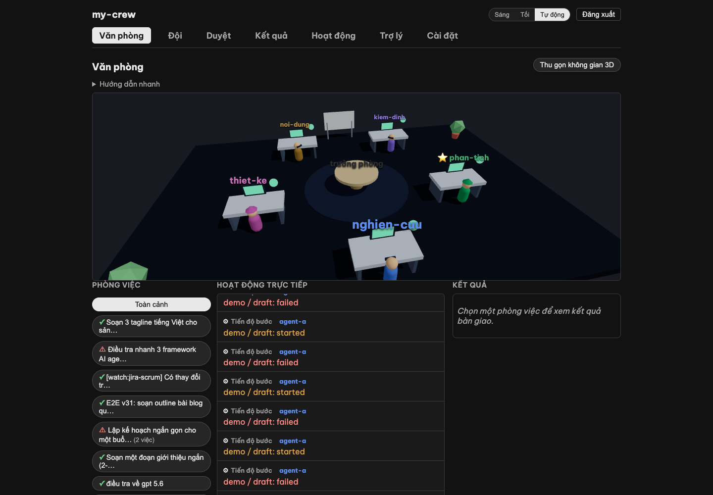

    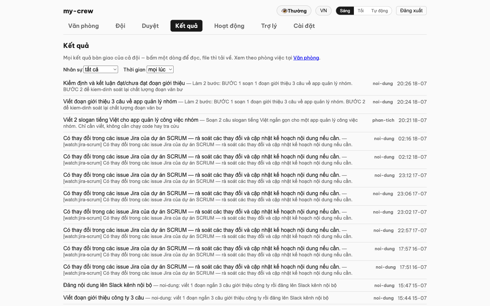


    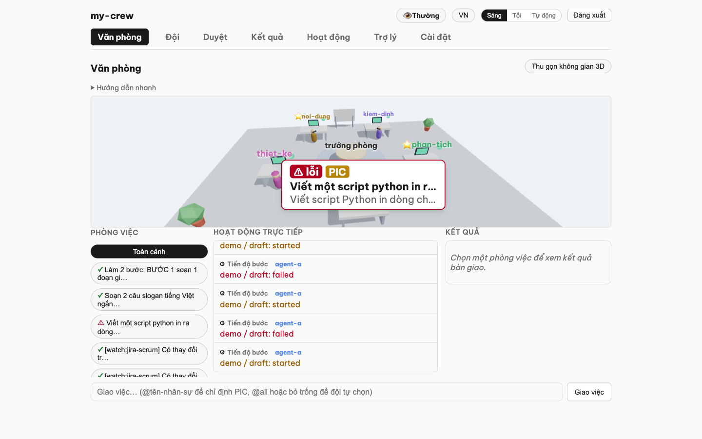

  - Không gian 3D (v32 "đại tu visual"): bàn trưởng phòng ở giữa, mỗi nhân sự một bàn với **màu avatar riêng** (stable per agent, 8 sắc thái), bàn có **trạng thái hiển thị trên màn hình** (xám/xanh/cam/xanh lá). Camera **tự xoay 360° chậm** (dừng khi bạn kéo chuột), nội thất văn phòng (chậu cây, bảng viết, ghế sofa, đèn cây); hai nhân sự hỏi ý kiến nhau thì **hai avatar rời bàn đi lại gần nhau** rồi tự về chỗ. Bàn của **PIC** có dấu ⭐ + nhãn PIC. **Bấm vào bàn** = mở phòng việc (nếu đang chạy) hoặc trang agent (nếu rảnh); **hover tooltip** hiện trạng thái live. Panel 3D **gọn hơn** (38vh cap 400px) nên máy 1280×800 thấy 3D + feed + composer **cùng lúc**. Mọi chuyển động đều từ sự kiện thật — không có hoạt cảnh giả.
  - **Nhật ký văn phòng** (menu nâng cao, `Văn phòng → Nhật ký`): dòng thời gian ĐẦY ĐỦ
    theo từng phòng việc — mỗi sự kiện 1 dòng (người, hành động, thời gian), có chọn
    phòng theo việc.

    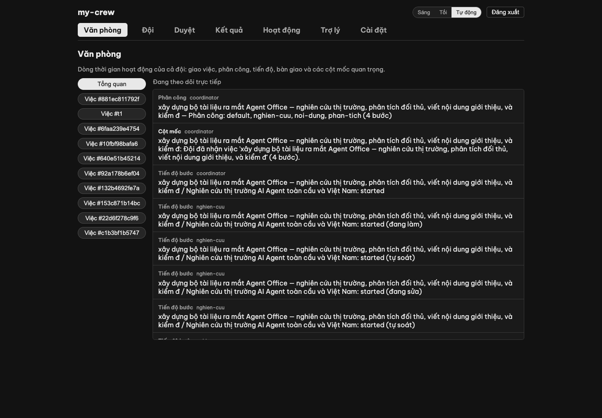

    Bong bóng còn hiện **giai đoạn của bước** theo thời gian thực: *đang làm* → *tự soát* →
    *đang sửa*, và V14 thêm *nhờ trợ giúp* (khi bước gặp lỗi, nhân sự tự hỏi đồng nghiệp và
    thử lại một lần trước khi báo thất bại).

    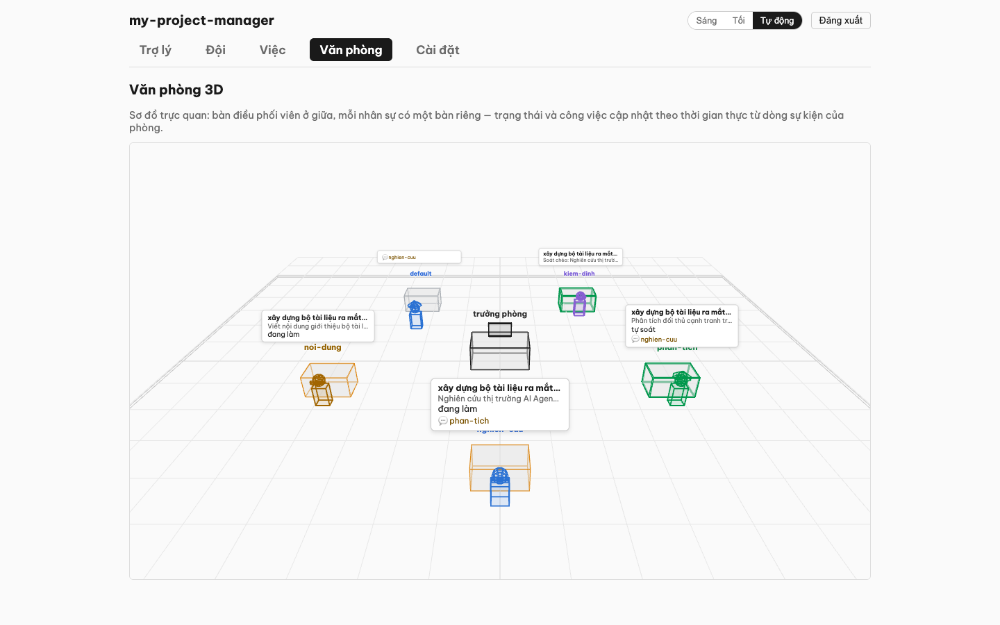

    Khi hai nhân sự tham vấn nhau, avatar **rời bàn đi lại gần nhau** rồi tự về chỗ; bàn của
    người đang chạy sáng lên. Mọi chuyển động đều từ sự kiện thật — không có hoạt cảnh giả.

    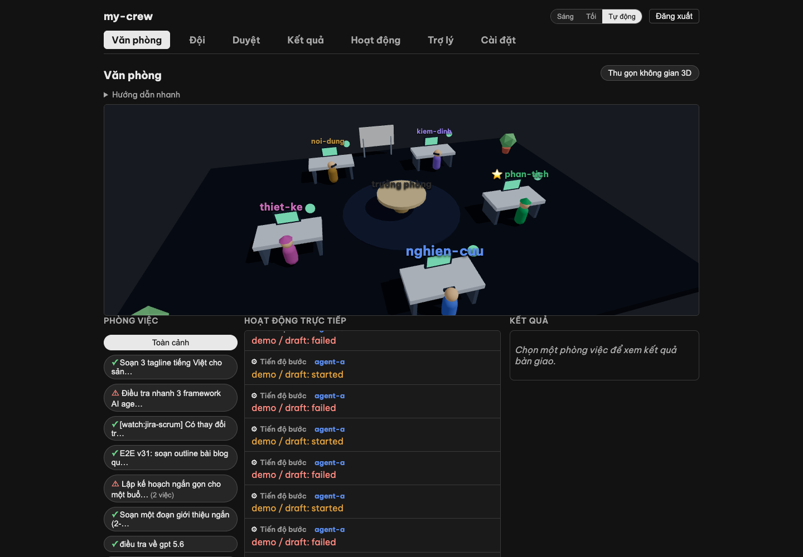
- Nếu một agent **chết ngầm** (quá hạn không chạy), hệ thống tự nhắn cảnh báo cho bạn qua Telegram.

## B.5g. Xem chi phí việc + cảnh báo tầng sandbox (v50 — UI catch-up)

Trên bảng kanban (tab **Duyệt** hoặc xem chi tiết việc):
- **Ai thực hiện**: cột "Ai thực hiện" trong **Hoạt động công ty** (v31) giờ hiển thị rõ tên agent đã làm hành động — nếu agent khác vào giải quyết vấn đề (ví dụ: coordinator A giao việc mà B đảm nhận), tag "[bởi B]" hiện bên cạnh để rõ ai chính thức làm.
- **Mức độ sandbox cần thiết**: mỗi thẻ việc dán badge **"🔒 N sandbox"** (N = số bước cần chạy trong Docker sandbox) — giúp bạn nhìn nhanh việc nào phức tạp/tốn tài nguyên.
- **Chi phí từng việc**: bấm nút **"Chi phí"** (v50) trên thẻ kanban → mở panel chi tiết: **mỗi bước** (engine + tokens) + **tổng việc**. Thuận tiện để theo dõi ngân sách và tránh việc chạy quá đắt.

## B.6. Tạo agent với tính năng in-sandbox (deep_team — v50)

Khi tạo agent ở trang **Đội** hoặc wizard, nếu bạn chọn **runtime = "Deep Agent"** (chạy trong Docker sandbox), wizard hiện thêm **tùy chọn "Điều phối trợ lý con"** — bật lên cho phép agent giao việc con TRONG hộp cát (chia ngữ cảnh lớn cho ≤3 trợ lý nhỏ chuyên môn, không cần tạo agent thật).

Cài đặt mặc định: `deep_team: false` (agent chạy độc lập). Bật `deep_team: true` + đặt `deep_team_max_calls` (mặc định 3 lần) nếu muốn sử dụng tính năng này.

## B.7. Đổi giao diện (sáng / tối)

Góc phải trên cùng có nút **Sáng / Tối / Tự động**. "Tự động" theo cài đặt của máy. Lựa chọn được ghi
nhớ cho lần sau.

## B.8. Chế độ nâng cao (khi cần xem sâu)

Vào **Cài đặt → Chế độ hiển thị** → bật **"Chế độ nâng cao"**. Thanh điều hướng hiện thêm các trang kỹ
thuật (tất cả tiếng Việt):

| Trang | Nội dung |
|---|---|
| **Tổng quan** | Bảng toàn bộ agent + trạng thái. |
| **Dòng thời gian** | Lịch sử các lần chạy. |
| **Chi phí** | Biểu đồ chi phí so với ngân sách. |
| **Bộ nhớ** | Điều trợ lý đã ghi nhớ + đề xuất chờ duyệt. |
| **Guardrail** | Nhật ký cửa kiểm soát: việc nào cho chạy / bị chặn / chờ duyệt. |
| **Cấu hình** | Chỉnh hồ sơ agent (danh tính, ngữ cảnh dự án). |
| **Chạy tay** | Chạy một báo cáo ngay, chọn loại + đối tượng (nội bộ / đối ngoại). |
| **Văn phòng** | Dòng thời gian công việc đội + 3D wireframe office (nếu bật v12). |

Tắt lại để về giao diện gọn 4 mục. Chế độ này chỉ đổi *độ chi tiết hiển thị*, không đổi quyền hạn.

## B.9. Chế độ demo (công ty mẫu, sẵn sàng cho khách xem)

Cần cho khách/đồng nghiệp xem sản phẩm mà không lộ dữ liệu thật? Bật **demo mode**:

```bash
scripts/demo-mode.sh on      # bật: công ty demo + đội 6 nhân sự chuẩn + văn phòng đang hoạt động
scripts/demo-mode.sh off     # tắt: trả lại nguyên vẹn dữ liệu thật (đã kiểm chứng byte-identical)
scripts/demo-mode.sh status  # đang ở chế độ nào
```

Khi bật, bạn có ngay: công ty "Công ty Demo — Một Người Vận Hành" với trưởng phòng +
5 nhân sự (nghiên cứu / nội dung / phân tích / kiểm định / thiết kế), và Văn phòng 3D
đang sống giữa chừng một việc thật: nghiên cứu đã bàn giao, phân tích đang làm và đang
tham vấn nghiên cứu (hai avatar đứng cạnh nhau 💬), nội dung đang sửa theo soát chéo,
thiết kế chờ tới lượt. Có thể giao thêm việc thật ngay trong demo (cần LLM key trong
`.env` — demo mode không đụng `.env`).

An toàn: dữ liệu thật (registry, company, hồ sơ nhân sự trùng tên, timeline/việc) được
**di chuyển** vào `.demo-backup/` (không copy-đè) và trả lại nguyên vẹn khi tắt; các
nhân sự demo đặt `dry_run: true` nên không ghi gì ra kênh ngoài. Lưu ý: đang bật demo
thì `registry.yaml` khác bản gốc — **tắt demo trước khi commit code**.

---

## Câu hỏi thường gặp

**Trợ lý có tự đăng linh tinh ra ngoài không?** Không. Mọi việc gửi ra ngoài công ty đều vào hàng đợi
**Việc** chờ bạn duyệt. Việc nguy hiểm thì bị chặn cứng, kể cả bạn muốn duyệt.

**Lỡ trợ lý làm sai thì sao?** Mọi hành động ghi vào một nhật ký không sửa được (audit log), và bạn
duyệt trước những việc có tác động. Việc gây mất-dữ-liệu vĩnh viễn thì hệ thống không cho làm.

**Tốn tiền không?** Có giới hạn ngân sách LLM $50/tháng, tự dừng khi chạm trần, cảnh báo ở mức 80%.

**Agent không chạy, kiểm tra ở đâu?** **Cài đặt → Sức khỏe hệ thống** — bảng ✓/✗ + lệnh khắc phục.

**Muốn cài lại / cập nhật?** Chạy lại `./deploy/install.sh` (Phần A.2) — an toàn, không phá gì nếu
không có thay đổi.

**Nhân sự Nghiên cứu có dùng web search không?** Nếu bật ở Setup Wizard (bước 5), nó sẽ tìm kiếm web khi cần. Không bật = chỉ dùng dữ liệu nội bộ. Web search được che chắn (query không xem được, chỉ tóm tắt kết quả).

**Giao việc cho đội mất bao lâu?** Tùy độ phức tạp, từ vài phút (công việc đơn) đến vài giờ (đa bước). Tiền tố tính chi phí + hỏi bạn confirm trước khi chạy. Nếu quá budget ($2/việc mặc định), hệ thống dừng + báo bạn.

**Soát chéo (peer review) hoạt động như thế nào (v13)?** Sau mỗi bước xong, một đồng nghiệp khác (tự động chọn, thường là kiểm định/QA nếu có) sẽ soát lại. Họ có thể chấp thuận ("đạt") hoặc yêu cầu sửa ("cần sửa"). Nếu cần sửa, tác giả bước sửa lại ≤2 lần. Nếu vẫn không đạt, hệ thống báo CEO.

**Tự kiểm (self-check) là gì (v13)?** Sau khi làm xong bước, trợ lý tự đối chiếu bước với yêu cầu (criteria) của bước đó. Nếu chưa tốt, nó tự sửa (rework) ≤2 lần trước khi báo CEO. Cái này **tự động**, bạn không cần duyệt từng lần tự kiểm.

**Hỏi ý kiến đồng nghiệp tốn tiền không (v13)?** Có, nhưng **ít hơn một bước độc lập**. Hỏi ý kiến là tham khảo (≤2 câu/bước), không phải làm lại bước. Chi phí tính vào tổng của bước đó.

**Chỉnh kế hoạch giữa chừng có an toàn không (v13)?** Hoàn toàn an toàn. Những bước **đã xong** giữ nguyên (không mất dữ liệu). Chỉ những bước chờ chạy mới theo kế hoạch mới. CEO (bạn) xác nhận DIFF trước khi áp dụng.

**Bước kẹt quá 2 lần tự kiểm/soát thì sao (v13)?** Hệ thống dừng + báo CEO xem xét. Bạn có thể chỉnh kế hoạch (bỏ bước, giao lại người, hoặc tăng giới hạn sửa).

---

Xem thêm: [Changelog](project-changelog.md) · [Getting Started (EN, chi tiết)](v2/getting-started.md) ·
[Action Gateway — cơ chế an toàn](v1/action-gateway-explainer.md).
